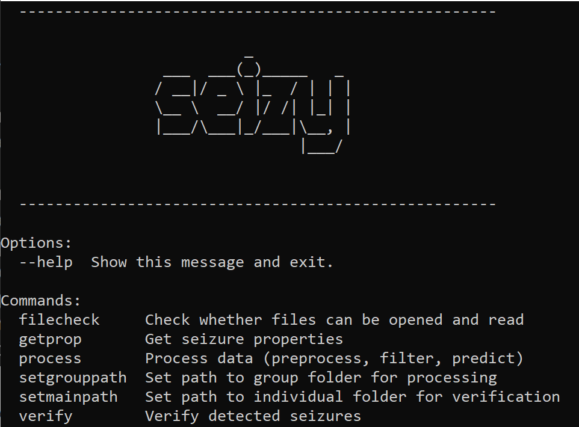

# Seizy
:snake: **Seizy** uses a simple thresholding method to easily find :detective: seizures from EEG recordings.
After the seizures are detected, they can be manually verified with a user-friendly GUI. It currently works on recordings stored in [Labchart (.adicht)](https://www.adinstruments.com/products/labchart) files. It therefore only works on windows OS due to Labchart API.

---

### How to install
1) Download and install [miniconda](https://docs.conda.io/en/latest/miniconda.html) on your platform
2) Clone or Download [seizy](https://github.com/pantelisantonoudiou/seizy)
3) Start Anaconda's shell prompt, navigate to */seizy* and create conda environment:

        conda env create -f environment.yml
        
---

### Launch CLI

1) By clicking on app.cmd executable

2) Via Anaconda's shell prompt

        # navigate to *seizy* folder
        cd ./seizy
        
        # enter conda environment
        conda activate seizy

        # Launch CLI
        python cli.py
 
### To run tests
        python -m pytest tests/

---  

### Configuration settings and file preparation
For configuration settings and file preparation check the [configuration](docs/configuration.md) document.

---
        
### Tutorials
Visit the [tutorial doc](docs/tutorial.md) for a quick walkthrough.

---

        
        
        
        
