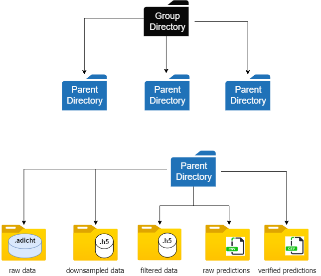

## Configuration settings

#### -> To be provided by user
- **group_path** : path to group of parent directories, e.g. "C:\\Users\\...\\group directory\\parent directory"
- **main_path** : path to parent directory, e.g. "C:\\Users\\...\\parent directory"
- **data_dir** : child directory name where .adicht files are present, default is "raw_data"
- **ch_struct** : List containing the names of LFP/EEG channels, e.g. ["blank, "vhpc", "emg", "pfc"]
- **ch_list** : Selected channel to run predictions, Default is [1] -> "vhpc", e.g. [3]-> "pfc" (2 Channels have to be selected)
- **win** : window size in seconds, default is 5 seconds
- **new_fs** : sampling rate of .h5 files, default is 100 Hz

#### -> Created during app execution
- **org_dir** : child directory name where decimated .h5 data are present, default is "downsampled_data"
- **filt_dir** : child directory name where filtered .h5 data present, default is "filt_data"
- **rawpred_dir** : child directory name where raw predictions are present (.csv), default is "raw_predictions"
- **verpred_dir** : child directory name where user verified predictions are present (.csv), default is "verified_predictions"

---
## Path organization

---

**[<< Back to Main Page](/README.md)**
