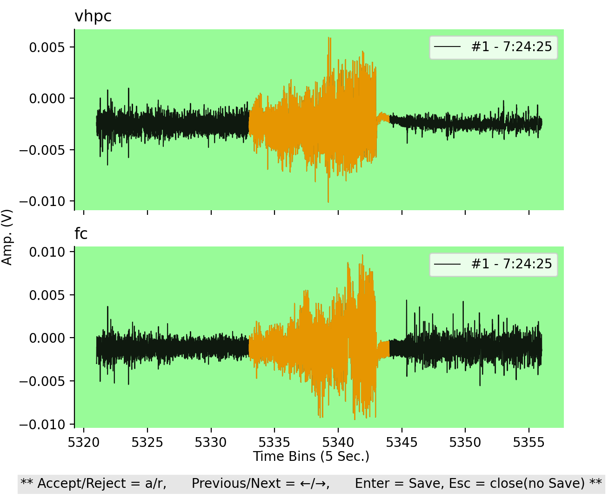

## Tutorial

1) **Launch Conda Shell Prompt**

2) **Set group folder for data processing.**
```
python cli.py setgrouppath
```
- The [group folder](configuration.md#path-organization) can contain more than one parent folders.
- The labchart files in one parent folder should **contain recordings from the same animals in the same channel order**.
- Each parent folder name should contain the ID of the animals separated with an underscore (E.g. '1001_4254_4253_1003').
- The number of IDs should be equal to the total number of channels in a labchart file 
divided by the provided [channel structure](configuration.md).
- Exactly **Two** LFP/EEG channels are selected in [configuration settings](configuration.md).

3) **Run file check.**
```
python cli.py filecheck
```

4) **Preprocess data and generate predictions.**

- This is the step where the raw data files will be downsampled, filtered and also where seizures will be detected.
- Therefore, this is the most time consuming step. 
- Running this will create a reorganized, filtered and predictions folder under each parent directory.
```
python cli.py process
```

5) **Set [parent folder](configuration.md#path-organization) for seizure verification.**
```
python cli.py setmainpath
```

6) **Verify seizures and adjust seizure boundaries.**
- This will launch a prompt to allow for file selection for verification.
- After the file selection, a GUI will be launched for seizure verfication and seizure oundary adjustment. 
```
python cli.py verify
```



7) **Get seizure properties.** 
-This step will generate and csv file under the parent folder with seizure properties
for each file.
```
python cli.py getprop
```

----

**[<< Back to Main Page](/README.md)**


